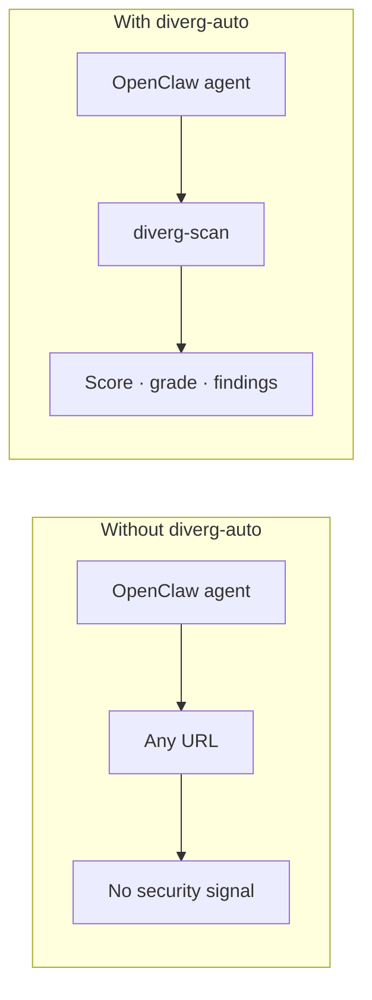
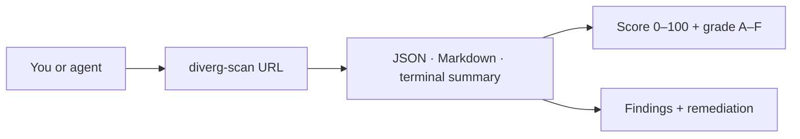
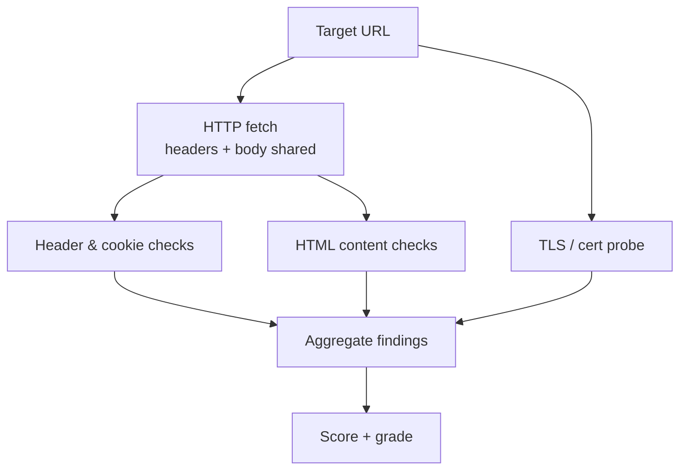
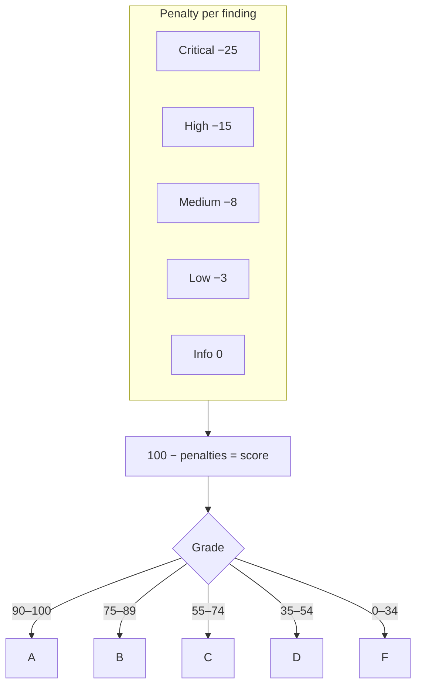
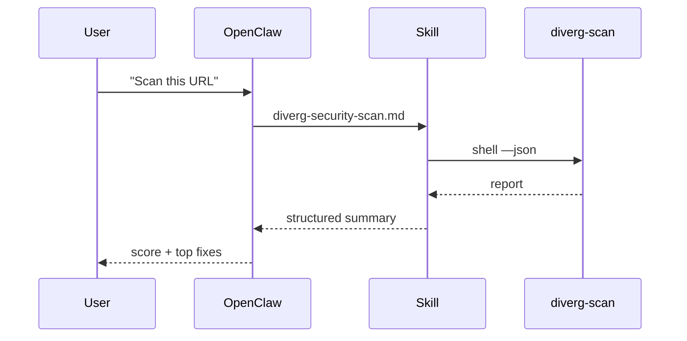
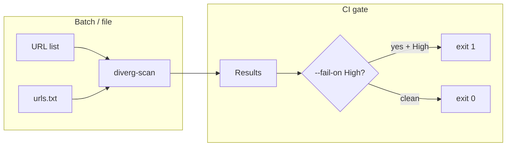

# Tweet thread — diverg-auto (with diagram visuals)

**Repo:** https://github.com/fennq/diverg-auto

Use **one diagram per tweet** (or combine two short ones). Export Mermaid to PNG:

1. Open https://mermaid.live — paste the code block under each diagram → **Actions → PNG/SVG**.
2. Or use VS Code “Markdown Preview Mermaid Support” → screenshot the preview.
3. Recommended size for X: **1200×675** or square **1080×1080** — crop if needed.

Thread order matches the diagrams below.

---

## Diagram 1 — The gap (tweet 1 visual)

**Concept:** Agents browse blindly until you give them a scanner.



---

### Tweet 1 / 8

Your AI agent can browse the web — read pages, follow links, call APIs.

But **it has no built-in idea** whether a site is a phishing trap, missing HTTPS hardening, or leaking stack details.

We shipped **diverg-auto** so agents get a real security readout in seconds.

[](attach: diagram 1 — before/after)

🔗 https://github.com/fennq/diverg-auto

---

## Diagram 2 — One command in (tweet 2 visual)



---

### Tweet 2 / 8

One tool, three outputs:

`diverg-scan https://target.com`

→ **Score + letter grade** (so the model can reason in one number)  
→ **Structured findings** (evidence, impact, fix)  
→ **Tech fingerprint + redirect chain** (context, not guesswork)

[](attach: diagram 2)

---

## Diagram 3 — What runs under the hood (tweet 3 visual)



---

### Tweet 3 / 8

Passive only — we **read** what the server sends. No exploitation.

**Headers + body** share **one** request (fast). **TLS** is a separate check: protocol, cert life, weak patterns.

Everything rolls into **one report** your agent or CI can consume.

[](attach: diagram 3)

---

## Diagram 4 — Severity → score (tweet 4 visual)



---

### Tweet 4 / 8

Why a **0–100 score** matters for agents:

They don’t have to parse a 40-page pentest PDF. They get **one number + one letter**, then drill into Critical/High only when needed.

Grading is transparent: severity-weighted deductions from 100.

[](attach: diagram 4)

---

## Diagram 5 — OpenClaw path (tweet 5 visual)



---

### Tweet 5 / 8

**OpenClaw** integration is a single skill file.

Natural language in → `diverg-scan --json` → parse → human-readable summary out.

Install the skill from the repo’s `skills/` folder. Agent can **auto-install** the package if it’s missing.

[](attach: diagram 5)

---

## Diagram 6 — CI + batch (tweet 6 visual)



---

### Tweet 6 / 8

Same engine for **pipelines**:

- `diverg-scan url1 url2 url3`
- `diverg-scan --file urls.txt`
- `diverg-scan --fail-on High` → **non-zero exit** when it matters

Plus **Markdown reports** for humans: `diverg-scan --markdown -o report.md`

[](attach: diagram 6)

---

### Tweet 7 / 8

**Scope:** this is Diverg’s **web security** lane — headers, TLS, CSP, cookies, content signals, CORS, disclosure.

On-chain / wallet forensics stays in the main **Diverg** repo for now.

`pip install diverg-lite` (PyPI package — repo/product branding: **diverg-auto**)  
https://github.com/fennq/diverg-auto

---

### Tweet 8 / 8

MIT licensed. Star the repo if you want agents to stop flying blind.

Questions / PRs welcome.

#OpenClaw #AppSec #AIAgents

---

## Alt text ideas (accessibility)

| Diagram | Suggested alt |
|--------|----------------|
| 1 | Before: agent to URL with no security signal. After: agent through diverg-scan to score and findings. |
| 2 | Flow: user or agent runs diverg-scan, outputs JSON markdown or summary with score and findings. |
| 3 | Target URL splits into shared HTTP fetch for headers and body, plus TLS probe, then aggregate score. |
| 4 | Penalties Critical through Info subtract from 100, map to grades A through F. |
| 5 | Sequence: user asks OpenClaw, skill runs diverg-scan, returns JSON summary to user. |
| 6 | Multiple URLs or urls.txt into diverg-scan; optional fail-on High exits 1 in CI. |

---

## Quick ASCII (if you skip Mermaid)

Tweet 1 backup visual:

```
  BEFORE                    AFTER
 ┌─────────┐               ┌─────────┐
 │ Agent   │──► ???       │ Agent   │
 └─────────┘               └────┬────┘
                                │
                         diverg-scan
                                │
                         72/100  Grade B
```
